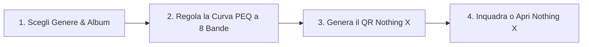

# Sound Studio (1) Pro per Nothing Ear

<div align="center">

```
   _____                      _    _____ _             _ _         __ __   _____           
  / ____|                    | |  / ____| |           | (_)       /_ /_ | |  __ \          
 | (___   ___  _   _ _ __   __| | | (___ | |_ _   _  __| |_  ___   | || | | |__) | __ ___  
  \___ \ / _ \| | | | '_ \ / _` |  \___ \| __| | | |/ _` | |/ _ \  | || | |  ___/ '__/ _ \ 
  ____) | (_) | |_| | | | | (_| |  ____) | |_| |_| | (_| | | (_) | | || | | |   | | | (_) |
 |_____/ \___/ \__,_|_| |_|\__,_| |_____/ \__|\__,_|\__,_|_|\___/  |_||_| |_|   |_|  \___/ 
```

**La Suite Definitiva di Mastering Acustico & Motore PEQ Parametrico per Auricolari e Cuffie Nothing**

[](LICENSE.md)
[](#-catalogo-discografico--database-acustico)
[](#-funzionalità-principali)
[](#-come-funziona)
[](#-autore--copyright)

🌐 **Leggi in altre lingue:** [🇬🇧 **English**](README.md)

</div>

---

## 🎧 Panoramica

**Sound Studio (1) Pro** è una suite di mastering acustico ad alta fedeltà sviluppata specificamente per l'ecosistema audio Nothing — inclusi **Nothing Ear**, **Nothing Ear (a)**, **Nothing Ear (2)**, **Nothing HeadPhone (1)** e auricolari **CMF Buds**.

Dotata di un **equalizzatore parametrico (PEQ) a 8 bande con filtri biquad interattivi** e di un vasto catalogo di **1.231 profili album calibrati in studio**, l'app genera istantaneamente codici QR conformi all'hardware Nothing, pronti per essere scansionati o importati direttamente nell'applicazione ufficiale **Nothing X**.

---

## ✨ Funzionalità Principali

### 🎛️ Motore PEQ a 8 Bande & Curva Parametrica su Canvas
- Visualizzatore in tempo reale della risposta in frequenza con nodi di controllo interattivi e trascinabili.
- Controllo parametrico completo su tutti gli 8 canali audio (Frequenza: 20 Hz – 20.000 Hz, Guadagno: da -6 dB a +6 dB, Fattore Q: da 0.1 a 10.0).
- Compensazione hardware automatica calibrata sulla fisica acustica dei diversi driver (es. transienti rapidi dei driver ceramici rispetto allo smorzamento dei diaframmi dinamici).

### 📚 Catalogo Discografico Curato (1.231 Profili)
- Calibrazioni di mastering meticolose che coprono **139 artisti leggendari** e **1.071 album storici**.
- Copertura generi enciclopedica: **Progressive Metal, Thrash, Heavy Metal, Death, Doom, Rock, Jazz, Classica e Pop**.
- Ricerca istantanea con autocompletamento in tempo reale per artista, album e anno di uscita.

### 📱 Protocollo QR Code Nothing X Nativo
- Generazione del payload ufficiale compresso con algoritmo **zlib (deflate) in Base64**, pienamente conforme al parser firmware di Nothing X.
- **⚡ Apertura Diretta**: pulsante dedicato per avviare all'istante l'app Nothing X su Android per importare la card o scansionare il preset.
- Esportazione **Audio Card ad alta risoluzione (300 DPI)** con tipografia Nothing OS a matrice di punti, cornice protetta e badge mixer a 9 barre per la condivisione e il salvataggio in galleria.

### 🌐 100% Offline & Standalone PWA (Zero CDN Esterne)
- Architettura self-hosted: tutte le librerie esterne ([`qrcode.min.js`](js/qrcode.min.js), [`pako.min.js`](js/pako.min.js)) sono memorizzate localmente.
- Caching con Service Worker (`sw.js`) per un funzionamento istantaneo senza connessione internet o in modalità aereo.
- Installabile come Progressive Web App (PWA) su Android, iOS, Windows, macOS e Linux.

### 🌍 Supporto Multilingua (9 Lingue)
- Interfaccia, etichette e notifiche toast tradotte al 100% in:
  - 🇮🇹 Italiano, 🇬🇧 Inglese, 🇫🇷 Francese, 🇩🇪 Tedesco, 🇪🇸 Spagnolo, 🇷🇺 Russo, 🇨🇳 Cinese Mandarino, 🇮🇳 Hindi e 🇸🇦 Arabo Standard Moderno (con layout nativo RTL da destra a sinistra).

---

## 🚀 Come Funziona



1. **Seleziona un Album**: Cerca tra i 1.231 preset del catalogo o seleziona un archetipo di genere.
2. **Esamina la Curva Acustica**: Il canvas interattivo a 8 bande si aggiorna in tempo reale con le note tecniche di mastering.
3. **Genera & Importa**: Il codice QR Nothing X si aggiorna all'istante. Inquadralo con la fotocamera di Nothing X o premi **"Apri Nothing X"** per trasferire il profilo ai tuoi auricolari in un secondo.

---

## 🛠️ Struttura del Progetto

```
sound-studio-1-pro/
├── index.html                 # Markup principale & layout Nothing OS
├── manifest.webmanifest       # Metadati PWA manifest
├── sw.js                      # Service Worker cache-first per l'offline
├── LICENSE.md                 # Testo legale licenza CC BY-NC 4.0
├── README.md                  # Documentazione ufficiale in inglese
├── README.it.md               # Documentazione ufficiale in italiano (questo file)
├── css/
│   └── style.css              # Stili tema dark/light & font dot-matrix Nothing OS
├── js/
│   ├── app.js                 # Controller UI, visualizzatore Canvas & routing eventi
│   ├── database.js            # 1.231 profili studio calibrati (139 artisti)
│   ├── protocol.js            # Compressione Nothing X QR & codificatore binario
│   ├── pako.min.js            # Motore locale di decompressione zlib
│   ├── qrcode.min.js          # Generatore locale matrice QR
│   └── i18n/                  # Sistema di internazionalizzazione (9 lingue)
└── icons/                     # Icone PWA in stile Nothing OS a matrice di punti
```

---

## 🔒 Architettura Privata AI & Moduli Pro

Sound Studio (1) Pro include un'architettura modulare "air-gapped" per estensioni riservate:
- Il rilascio pubblico contiene zero chiavi API remote, tracciamenti o script terzi.
- Le funzionalità sperimentali di Intelligenza Artificiale (ingegnere del suono multi-provider con Gemini, OpenAI, Claude, DeepSeek e server locale Ollama) risiedono in una cartella riservata locale (`private_ai_archive/`) e possono essere iniettate dinamicamente senza alterare il codice pubblico.

---

## 👤 Autore & Copyright

- **Ideatore & Sound Designer**: **sokkaUmB**
- **Repository Ufficiale**: [https://github.com/sokkaUmB/sound-studio-1-pro](https://github.com/sokkaUmB/sound-studio-1-pro)

---

## 📄 Licenza d'Uso

Questo progetto è distribuito sotto licenza **Creative Commons Attribution-NonCommercial 4.0 International Public License** ([`CC BY-NC 4.0`](LICENSE.md)).

```
Sei libero di:
- Condividere — copiare e ridistribuire il materiale con qualsiasi mezzo e formato
- Modificare — remixare, trasformare il materiale e basarti su di esso

Ai seguenti termini:
- Attribuzione — Devi riconoscere la paternità dell'opera a sokkaUmB.
- NonCommerciale — Non puoi usare il materiale per fini commerciali o di lucro.
```

---

## ⚠️ Esclusione di Responsabilità (Disclaimer)

*Sound Studio (1) Pro è un progetto indipendente e open-source sviluppato dalla community a cura di **sokkaUmB**, non affiliato, autorizzato, sponsorizzato né collegato a Nothing Technology Limited.*  
*Nothing, Nothing Ear, Nothing HeadPhone (1) e Nothing X sono marchi registrati di Nothing Technology Limited.*
