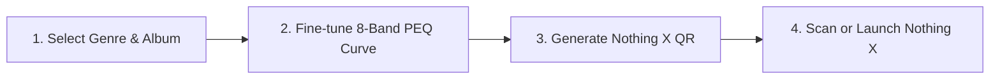

# Sound Studio (1) Pro for Nothing Ear

<div align="center">

```
   _____                      _    _____ _             _ _         __ __   _____           
  / ____|                    | |  / ____| |           | (_)       /_ /_ | |  __ \          
 | (___   ___  _   _ _ __   __| | | (___ | |_ _   _  __| |_  ___   | || | | |__) | __ ___  
  \___ \ / _ \| | | | '_ \ / _` |  \___ \| __| | | |/ _` | |/ _ \  | || | |  ___/ '__/ _ \ 
  ____) | (_) | |_| | | | | (_| |  ____) | |_| |_| | (_| | | (_) | | || | | |   | | | (_) |
 |_____/ \___/ \__,_|_| |_|\__,_| |_____/ \__|\__,_|\__,_|_|\___/  |_||_| |_|   |_|  \___/ 
```

**The Ultimate Acoustic Mastering Suite & Parametric EQ Engine for Nothing Ear & Headphones**

[](LICENSE.md)
[](#-discography--acoustic-database)
[](#-key-features)
[](#-how-it-works)
[](#-author--copyright)

🌐 **Read in other languages:** [🇮🇹 **Italiano**](README.it.md)

</div>

---

## 🎧 Overview

**Sound Studio (1) Pro** is an open-source, high-fidelity acoustic mastering suite engineered specifically for the Nothing audio ecosystem — including **Nothing Ear**, **Nothing Ear (a)**, **Nothing Ear (2)**, **Nothing HeadPhone (1)**, and **CMF Buds**.

Featuring an interactive **8-band biquad parametric equalizer (PEQ)** and an extensive database of **1,231 studio-calibrated album profiles**, it generates instant, hardware-compliant QR codes that can be scanned or imported directly into the official **Nothing X** app.

---

## ✨ Key Features

### 🎛️ Interactive 8-Band PEQ Engine & Canvas Curve
- Real-time biquad audio response visualizer with interactive, draggable control nodes.
- Full parametric control across all 8 frequency channels (Frequency: 20 Hz – 20,000 Hz, Gain: -6 dB to +6 dB, Q-Factor: 0.1 to 10.0).
- Automatic hardware calibration compensation tailored to different driver physics (e.g., rapid ceramic transience vs. dynamic diaphragm dampening).

### 📚 Curated Acoustic Database (1,231 Profiles)
- Deeply researched mastering calibrations covering **139 legendary artists** and **1,071 iconic albums**.
- Comprehensive genre coverage: **Progressive Metal, Thrash, Heavy Metal, Death, Doom, Rock, Jazz, Classical, and Pop**.
- Instant search with real-time autocompletion by artist, album, and release year.

### 📱 Hardware Nothing X QR Code Protocol
- Generates official, compressed **zlib-deflated base64** payloads compatible with the Nothing X firmware parser.
- **⚡ Direct Launch**: Includes a dedicated *"Launch Nothing X"* button to instantly open the Nothing X app on Android to import or scan the preset.
- High-resolution (300 DPI) **Audio Card Export** with Nothing OS typography, QR frame, and 9-bar mixer badge for photo gallery saving and sharing.

### 🌐 100% Offline & Standalone PWA (Zero External CDNs)
- Self-hosted architecture: all libraries ([`qrcode.min.js`](js/qrcode.min.js), [`pako.min.js`](js/pako.min.js)) are bundled locally.
- Service Worker caching (`sw.js`) enables instant, full functionality without an internet connection or in airplane mode.
- Installable as a progressive web app (PWA) on Android, iOS, Windows, macOS, and Linux.

### 🌍 Multi-Language Support (9 Languages)
- Fully localized UI strings, labels, and toast notifications in:
  - 🇬🇧 English, 🇮🇹 Italian, 🇫🇷 French, 🇩🇪 German, 🇪🇸 Spanish, 🇷🇺 Russian, 🇨🇳 Mandarin Chinese, 🇮🇳 Hindi, and 🇸🇦 Modern Standard Arabic (with native RTL layout).

---

## 🚀 How It Works



1. **Select an Album**: Search from the 1,231-preset database or select a genre archetype.
2. **Review the Acoustic Curve**: The 8-band interactive canvas updates instantly with studio mastering notes.
3. **Generate & Import**: The Nothing X QR code updates in real-time. Scan it with the Nothing X app or click **"Open Nothing X"** to import the profile to your earphones in 1 second.

---

## 🛠️ Project Structure

```
sound-studio-1-pro/
├── index.html                 # Core application markup & Nothing OS layout
├── manifest.webmanifest       # PWA manifest metadata
├── sw.js                      # Cache-first offline Service Worker
├── LICENSE.md                 # CC BY-NC 4.0 legal terms
├── README.md                  # English documentation (this file)
├── README.it.md               # Italian documentation
├── css/
│   └── style.css              # Nothing OS dark/light theme & dot-matrix typography
├── js/
│   ├── app.js                 # UI controllers, Canvas visualizer & event router
│   ├── database.js            # 1,231 calibrated studio profiles (139 artists)
│   ├── protocol.js            # Nothing X QR compression & binary encoder
│   ├── pako.min.js            # Local zlib deflation engine
│   ├── qrcode.min.js          # Local QR matrix generator
│   └── i18n/                  # Multi-language localization system (9 locales)
└── icons/                     # Nothing OS dot-matrix PWA app icons
```

---

## 🔒 Private AI & Pro Architecture

Sound Studio (1) Pro includes a modular, air-gapped architecture for private extensions:
- The public release contains zero proprietary API keys, remote analytics, or tracking scripts.
- Private AI features (multi-provider sound engineering with Gemini, OpenAI, Claude, DeepSeek, and local Ollama) reside in an isolated local module (`private_ai_archive/`) and can be dynamically injected into the workspace without altering public code.

---

## 👤 Author & Copyright

- **Author & Sound Designer**: **sokkaUmB**
- **Repository**: [https://github.com/sokkaUmB/sound-studio-1-pro](https://github.com/sokkaUmB/sound-studio-1-pro)

---

## 📄 License

This project is licensed under the **Creative Commons Attribution-NonCommercial 4.0 International Public License** ([`CC BY-NC 4.0`](LICENSE.md)).

```
You are free to:
- Share — copy and redistribute the material in any medium or format
- Adapt — remix, transform, and build upon the material

Under the following terms:
- Attribution — You must give appropriate credit to sokkaUmB.
- NonCommercial — You may not use the material for commercial purposes.
```

---

## ⚠️ Disclaimer

*Sound Studio (1) Pro is an independent, open-source community project developed by **sokkaUmB** and is not affiliated with, endorsed by, or sponsored by Nothing Technology Limited.*  
*Nothing, Nothing Ear, Nothing HeadPhone (1), and Nothing X are registered trademarks of Nothing Technology Limited.*
